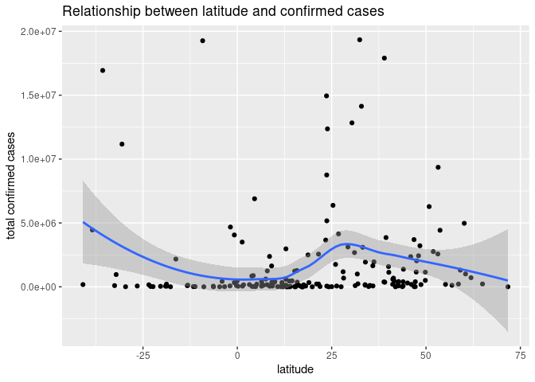
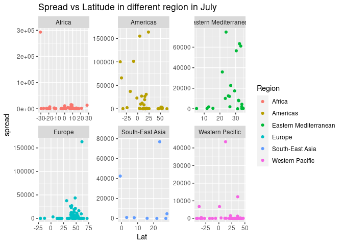
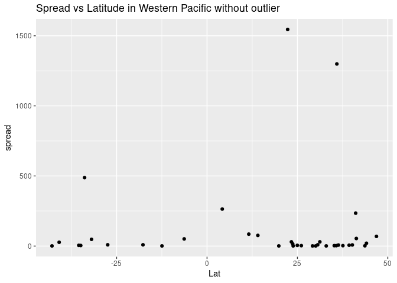
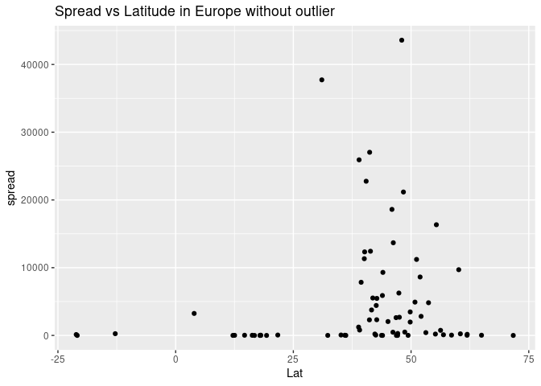
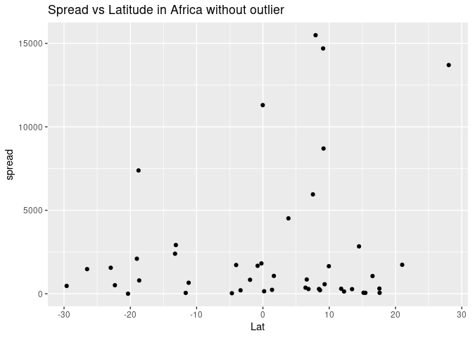
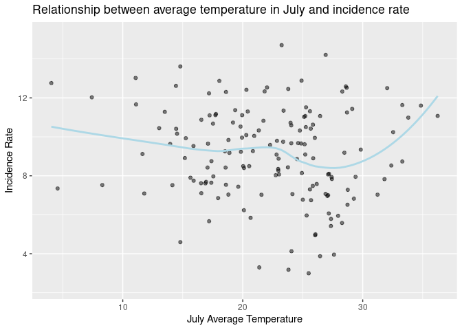
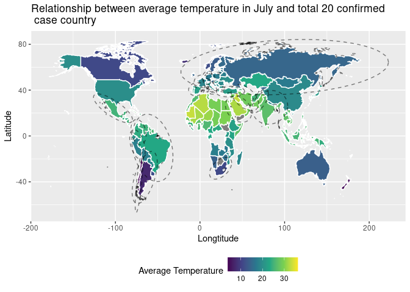
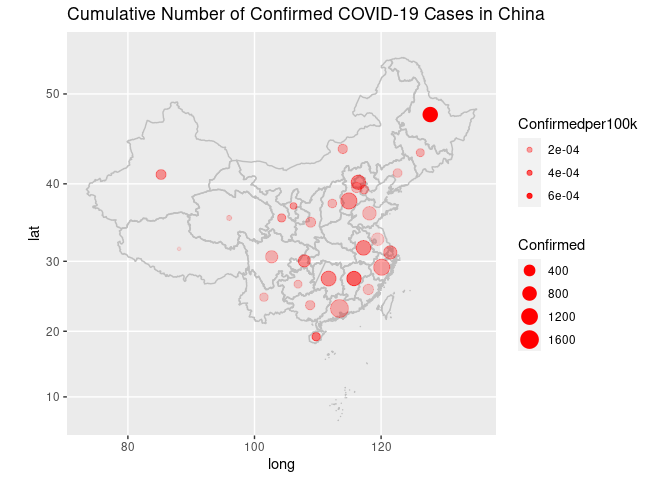
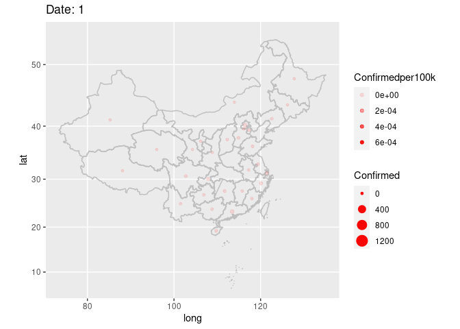
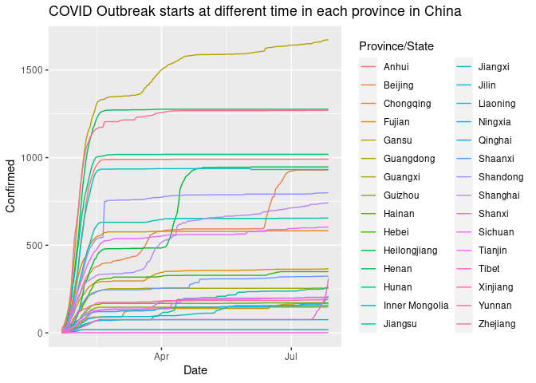

COVID-19: Effects of Temperature
================
Team Zeta
2020-10-27

  - [Load the dataset](#load-the-dataset)
  - [Process the data](#process-the-data)

*Background*:
[COVID-19](https://en.wikipedia.org/wiki/Coronavirus_disease_2019) is
the disease caused by the virus SARS-CoV-2. In 2020 it became a global
pandemic, leading to huge loss of life and tremendous disruption to
society. The New York Times (as of writing) publishes up-to-date data on
the progression of the pandemic across the United States—we will study
these data in this challenge.

``` r
library(tidyverse)
```

    ## ── Attaching packages ────────────────────────────────────────────────── tidyverse 1.3.0 ──

    ## ✓ ggplot2 3.3.2     ✓ purrr   0.3.4
    ## ✓ tibble  3.0.3     ✓ dplyr   1.0.2
    ## ✓ tidyr   1.1.2     ✓ stringr 1.4.0
    ## ✓ readr   1.4.0     ✓ forcats 0.5.0

    ## ── Conflicts ───────────────────────────────────────────────────── tidyverse_conflicts() ──
    ## x dplyr::filter() masks stats::filter()
    ## x dplyr::lag()    masks stats::lag()

``` r
library(ggrepel)
library(ggpubr)
library(devtools)
```

    ## Loading required package: usethis

``` r
library(ggplot2)
library(proto)
library(base)
library(lubridate)
```

    ## 
    ## Attaching package: 'lubridate'

    ## The following objects are masked from 'package:base':
    ## 
    ##     date, intersect, setdiff, union

``` r
library(sf)
```

    ## Linking to GEOS 3.8.0, GDAL 3.0.4, PROJ 6.3.1

``` r
library(tmap)
library(maptools)
```

    ## Loading required package: sp

    ## Checking rgeos availability: TRUE

``` r
library(gganimate)
```

## Load the dataset

``` r
#covid_oct_filename <- "./data/COVID/covid_19.csv"
#covid_july_filename <- "./data/COVID/covid_19_july.csv"
#covid_may_filename <- "./data/COVID/covid_19_may.csv"
covid_july_filename <- "./data/covid_19_july.csv"
PopulationChina <- "./data/AnnualbyProvince.csv"
filename <- "./data/covid_19_clean_complete.csv"
temp_filename <- "./data/temp.csv"
temperature_filename <- "./data/covid_19_temp.csv"

mydat = readShapePoly("bou2_4p.shp")
```

    ## Warning: readShapePoly is deprecated; use rgdal::readOGR or sf::st_read

``` r
df_covid <- read_csv(filename)
```

    ## 
    ## ── Column specification ───────────────────────────────────────────────────────────────────
    ## cols(
    ##   `Province/State` = col_character(),
    ##   `Country/Region` = col_character(),
    ##   Lat = col_double(),
    ##   Long = col_double(),
    ##   Date = col_date(format = ""),
    ##   Confirmed = col_double(),
    ##   Deaths = col_double(),
    ##   Recovered = col_double(),
    ##   Active = col_double(),
    ##   `WHO Region` = col_character()
    ## )

``` r
df_covidTemp <- read_csv(filename)
```

    ## 
    ## ── Column specification ───────────────────────────────────────────────────────────────────
    ## cols(
    ##   `Province/State` = col_character(),
    ##   `Country/Region` = col_character(),
    ##   Lat = col_double(),
    ##   Long = col_double(),
    ##   Date = col_date(format = ""),
    ##   Confirmed = col_double(),
    ##   Deaths = col_double(),
    ##   Recovered = col_double(),
    ##   Active = col_double(),
    ##   `WHO Region` = col_character()
    ## )

``` r
df_popChina <- read_csv(PopulationChina) %>% select("Province/State", "Pop (k)")
```

    ## 
    ## ── Column specification ───────────────────────────────────────────────────────────────────
    ## cols(
    ##   `Province/State` = col_character(),
    ##   `Pop (k)` = col_double(),
    ##   `2018` = col_double(),
    ##   `2017` = col_double(),
    ##   `2016` = col_double(),
    ##   `2015` = col_double(),
    ##   `2014` = col_double(),
    ##   `2013` = col_double(),
    ##   `2012` = col_double(),
    ##   `2011` = col_double(),
    ##   `2010` = col_double()
    ## )

``` r
df_temp <- read_csv(temp_filename)
```

    ## Warning: Missing column names filled in: 'X1' [1]

    ## 
    ## ── Column specification ───────────────────────────────────────────────────────────────────
    ## cols(
    ##   X1 = col_double(),
    ##   Country = col_character(),
    ##   City = col_character(),
    ##   Jan = col_double(),
    ##   Feb = col_double(),
    ##   Mar = col_double(),
    ##   Apr = col_double(),
    ##   May = col_double(),
    ##   Jun = col_double(),
    ##   Jul = col_double(),
    ##   Aug = col_double(),
    ##   Sep = col_double(),
    ##   Oct = col_double(),
    ##   Nov = col_double(),
    ##   Dec = col_double(),
    ##   Avg_Year = col_double(),
    ##   Continent = col_character()
    ## )

``` r
df_covid_july <- read_csv(covid_july_filename)
```

    ## 
    ## ── Column specification ───────────────────────────────────────────────────────────────────
    ## cols(
    ##   FIPS = col_double(),
    ##   Admin2 = col_character(),
    ##   Province_State = col_character(),
    ##   Country_Region = col_character(),
    ##   Last_Update = col_datetime(format = ""),
    ##   Lat = col_double(),
    ##   Long_ = col_double(),
    ##   Confirmed = col_double(),
    ##   Deaths = col_double(),
    ##   Recovered = col_double(),
    ##   Active = col_double(),
    ##   Combined_Key = col_character(),
    ##   Incidence_Rate = col_double(),
    ##   `Case-Fatality_Ratio` = col_double()
    ## )

``` r
df_temp2 <- read_csv(temperature_filename)
```

    ## Warning: Missing column names filled in: 'X1' [1]

    ## 
    ## ── Column specification ───────────────────────────────────────────────────────────────────
    ## cols(
    ##   .default = col_double(),
    ##   country = col_character(),
    ##   Density_KM2m = col_number(),
    ##   Fertility_rate = col_character(),
    ##   Median_age = col_character(),
    ##   Urban_pop_pct = col_character(),
    ##   sex_male_to_female_total = col_character()
    ## )
    ## ℹ Use `spec()` for the full column specifications.

## Process the data

``` r
df_covid %>% glimpse
```

    ## Rows: 49,068
    ## Columns: 10
    ## $ `Province/State` <chr> NA, NA, NA, NA, NA, NA, NA, NA, "Australian Capital …
    ## $ `Country/Region` <chr> "Afghanistan", "Albania", "Algeria", "Andorra", "Ang…
    ## $ Lat              <dbl> 33.93911, 41.15330, 28.03390, 42.50630, -11.20270, 1…
    ## $ Long             <dbl> 67.709953, 20.168300, 1.659600, 1.521800, 17.873900,…
    ## $ Date             <date> 2020-01-22, 2020-01-22, 2020-01-22, 2020-01-22, 202…
    ## $ Confirmed        <dbl> 0, 0, 0, 0, 0, 0, 0, 0, 0, 0, 0, 0, 0, 0, 0, 0, 0, 0…
    ## $ Deaths           <dbl> 0, 0, 0, 0, 0, 0, 0, 0, 0, 0, 0, 0, 0, 0, 0, 0, 0, 0…
    ## $ Recovered        <dbl> 0, 0, 0, 0, 0, 0, 0, 0, 0, 0, 0, 0, 0, 0, 0, 0, 0, 0…
    ## $ Active           <dbl> 0, 0, 0, 0, 0, 0, 0, 0, 0, 0, 0, 0, 0, 0, 0, 0, 0, 0…
    ## $ `WHO Region`     <chr> "Eastern Mediterranean", "Europe", "Africa", "Europe…

``` r
df_avg <- 
  df_covid %>%  
  rename(region = 'Country/Region')  %>%
  group_by(region)  %>%
  summarise (
    totalConfirm = sum(Confirmed),
    totalDeath = sum(Deaths), 
    long = mean(Long),
    lat = mean(Lat)
    ) 
```

    ## `summarise()` ungrouping output (override with `.groups` argument)

``` r
df_avg
```

    ## # A tibble: 187 x 5
    ##    region              totalConfirm totalDeath   long   lat
    ##    <chr>                      <dbl>      <dbl>  <dbl> <dbl>
    ##  1 Afghanistan              1936390      49098  67.7   33.9
    ##  2 Albania                   196702       5708  20.2   41.2
    ##  3 Algeria                  1179755      77972   1.66  28.0
    ##  4 Andorra                    94404       5423   1.52  42.5
    ##  5 Angola                     22662       1078  17.9  -11.2
    ##  6 Antigua and Barbuda         4487        326 -61.8   17.1
    ##  7 Argentina                4450658      97749 -63.6  -38.4
    ##  8 Armenia                  1587173      27089  45.0   40.1
    ##  9 Australia                 960247      11387 141.   -32.1
    ## 10 Austria                  2034986      71390  14.6   47.5
    ## # … with 177 more rows

``` r
df_avg %>%
  filter(totalConfirm < 2e7) %>%
  ggplot(aes(x = lat, y = totalConfirm)) +
  geom_point() + 
  geom_smooth() + 
  labs(
    x= "latitude",
    y = "total confirmed cases",
    title = "Relationship between latitude and confirmed cases "
  )
```

    ## `geom_smooth()` using method = 'loess' and formula 'y ~ x'

<!-- -->

``` r
df_temp_avg <- 
  df_temp %>%
  group_by(Country) %>%
  summarise(
    avgOct = mean(Oct)
  ) %>%
  rename(region = Country)
```

    ## `summarise()` ungrouping output (override with `.groups` argument)

``` r
df_temp_avg
```

    ## # A tibble: 173 x 2
    ##    region              avgOct
    ##    <chr>                <dbl>
    ##  1 Afghanistan           13.1
    ##  2 Albania               16  
    ##  3 Algeria               23.7
    ##  4 Angola                25.2
    ##  5 Antigua and Barbuda   27.5
    ##  6 Argentina             16.1
    ##  7 Armenia               13.8
    ##  8 Aruba                 28.7
    ##  9 Australia             19.6
    ## 10 Austria               10.2
    ## # … with 163 more rows

``` r
df_temp_case <- merge(df_temp_avg,df_avg,by="region")
df_temp_case
```

    ##                       region    avgOct totalConfirm totalDeath        long
    ## 1                Afghanistan 13.100000      1936390      49098   67.709953
    ## 2                    Albania 16.000000       196702       5708   20.168300
    ## 3                    Algeria 23.666667      1179755      77972    1.659600
    ## 4                     Angola 25.200000        22662       1078   17.873900
    ## 5        Antigua and Barbuda 27.500000         4487        326  -61.796400
    ## 6                  Argentina 16.082353      4450658      97749  -63.616700
    ## 7                    Armenia 13.800000      1587173      27089   45.038200
    ## 8                  Australia 19.609091       960247      11387  141.355488
    ## 9                    Austria 10.200000      2034986      71390   14.550100
    ## 10                Azerbaijan 16.600000      1134717      14282   47.576900
    ## 11                   Bahrain 29.300000      1755206       5115   50.550000
    ## 12                Bangladesh 27.400000      8754729     115633   90.356300
    ## 13                  Barbados 27.500000        10652        738  -59.543200
    ## 14                   Belarus  6.600000      4426759      28391   27.953400
    ## 15                   Belgium 11.100000      6281116     963679    4.469936
    ## 16                    Belize 27.000000         2636        222  -88.497600
    ## 17                     Benin 26.866667        64406       1095    2.315800
    ## 18                   Bolivia 17.766667      2170351      78032  -63.588700
    ## 19    Bosnia and Herzegovina 11.000000       396634      16373   17.679100
    ## 20                  Botswana 24.733333        15306        120   24.684900
    ## 21                    Brazil 21.764286     89524967    3938034  -51.925300
    ## 22                  Bulgaria 11.300000       410722      17654   25.485800
    ## 23              Burkina Faso 29.250000        96153       5583   -1.561600
    ## 24                   Burundi 24.600000        11351        106   29.918900
    ## 25                  Cambodia 27.200000        17079          0  104.916700
    ## 26                  Cameroon 24.900000       844817      22354   11.502100
    ## 27                    Canada  4.586667      9356551     699566  -93.290858
    ## 28  Central African Republic 26.050000       198659       2010   20.939400
    ## 29                      Chad 29.600000        64226       5523   18.732200
    ## 30                     Chile 13.500000     16935654     322480  -71.543000
    ## 31                     China 13.640000     14132002     672413  111.785991
    ## 32                  Colombia 21.100000      6893122     236525  -74.297300
    ## 33                Costa Rica 21.800000       347151       2037  -83.753400
    ## 34                   Croatia 10.500000       299218      10372   15.200000
    ## 35                      Cuba 26.100000       216346       8145  -77.781167
    ## 36                    Cyprus 22.300000       107176       1962   33.429900
    ## 37                   Denmark  9.800000      1305978      60602    1.295000
    ## 38                  Djibouti 29.300000       336216       3011   42.590300
    ## 39                  Dominica 26.100000         2059          0  -61.371000
    ## 40        Dominican Republic 26.700000      2495433      61786  -70.162700
    ## 41                   Ecuador 19.950000      4678496     346618  -78.183400
    ## 42                     Egypt 22.650000      4142819     186936   30.802498
    ## 43               El Salvador 22.800000       453036      11429  -88.896500
    ## 44         Equatorial Guinea 25.150000       153258       2246   10.267900
    ## 45                   Eritrea 23.050000        11786          0   39.782300
    ## 46                   Estonia  6.500000       216505       6826   25.013600
    ## 47                  Ethiopia 18.250000       357928       5887   40.489700
    ## 48                      Fiji 25.100000         2266          0  178.065000
    ## 49                   Finland  4.666667       713167      30338   25.748151
    ## 50                    France 14.900000     21210926    3048524    5.458262
    ## 51                     Gabon 25.800000       330678       2497   11.609400
    ## 52                   Germany 10.250000     21059152     871322   10.451526
    ## 53                     Ghana 26.100000      1246644       6908   -1.023200
    ## 54                    Greece 20.350000       362615      19215   21.824300
    ## 55                 Greenland -0.700000         1507          0  -42.604300
    ## 56                    Guinea 26.350000       403605       2356   -9.696600
    ## 57             Guinea-Bissau 28.000000       122994       1291  -15.180400
    ## 58                    Guyana 27.600000        19089       1346  -58.930180
    ## 59                  Honduras 23.850000      1228583      37941  -86.241900
    ## 60                   Hungary 11.800000       396247      51053   19.503300
    ## 61                   Iceland  4.400000       221241       1141  -19.020800
    ## 62                     India 27.300000     40883464    1111831   78.962880
    ## 63                 Indonesia 27.200000      4057909     220272  113.921300
    ## 64                      Iran 19.933333     19339267    1024136   53.688046
    ## 65                      Iraq 23.050000      3093628     121392   43.679291
    ## 66                   Ireland 10.500000      2571918     161948   -7.692100
    ## 67                    Israel 22.000000      2677930      31627   34.851612
    ## 68                     Italy 14.900000     26745145    3707717   12.567380
    ## 69                   Jamaica 27.700000        61392       1005  -77.297500
    ## 70                     Japan 18.166667      1952495      85559  138.252924
    ## 71                Kazakhstan  7.250000      2430707      14621   66.923700
    ## 72                     Kenya 26.000000       464603      10463   37.906200
    ## 73                    Kuwait 27.300000      3120160      23084   47.481766
    ## 74                Kyrgyzstan 11.000000       596200      14979   74.766098
    ## 75                      Laos 26.400000         2229          0  102.495496
    ## 76                    Latvia  7.400000       118383       2458   24.603200
    ## 77                   Lebanon 24.100000       166607       3520   35.862300
    ## 78                     Libya 22.550000        62321       1612   17.228331
    ## 79             Liechtenstein 10.900000        10351        116    9.550000
    ## 80                 Lithuania  6.600000       188762       7019   23.881300
    ## 81                Luxembourg  9.500000       501355      11624    6.129600
    ## 82                Madagascar 22.566667       207296       1699   46.869107
    ## 83                    Malawi 23.600000        89666       1640   34.301500
    ## 84                  Malaysia 27.100000       876874      12971  101.975766
    ## 85                  Maldives 27.600000       173602        705   73.220700
    ## 86                      Mali 28.900000       151494       8229   -3.996166
    ## 87                     Malta 21.100000        67483        765   14.375400
    ## 88                Mauritania 26.050000       219095       6720  -10.940800
    ## 89                    Mexico 21.963636     14946202    1728277 -102.552800
    ## 90                   Moldova 10.500000      1156957      38196   28.369900
    ## 91                    Monaco 17.900000        11993        425    7.416700
    ## 92                  Mongolia  0.500000        16999          0  103.846700
    ## 93                Montenegro 15.900000        72422       1379   19.374390
    ## 94                   Morocco 19.833333      1002746      23170   -7.092600
    ## 95                Mozambique 22.400000        58006        361   35.529562
    ## 96                     Nepal 19.100000       682623       1660   84.250000
    ## 97               Netherlands 11.000000      5167516     622314  -49.180450
    ## 98               New Zealand 12.433333       175979       2181  174.886000
    ## 99                 Nicaragua 26.500000       137545       4867  -85.207229
    ## 100                    Niger 30.800000       102223       5948    8.081666
    ## 101                  Nigeria 27.080000      1634040      39416    8.675300
    ## 102          North Macedonia 13.100000       440483      21235   21.745300
    ## 103                   Norway  6.066667      1008821      25664    8.468900
    ## 104                     Oman 30.000000      2559773      11804   55.923255
    ## 105                 Pakistan 26.750000     12833994     264729   69.345100
    ## 106                   Panama 27.000000      2378126      51756  -80.782100
    ## 107         Papua New Guinea 27.500000         1185          2  143.955550
    ## 108                 Paraguay 23.200000       156373       1663  -58.443800
    ## 109                     Peru 17.933333     19263916     652113  -75.015200
    ## 110              Philippines 28.400000      2972611     110892  121.774017
    ## 111                   Poland  8.500000      2755525     118018   19.145100
    ## 112                 Portugal 18.800000      3855363     146603   -8.224500
    ## 113                  Romania 11.000000      2363132     140031   24.966800
    ## 114                   Russia  3.733333     45408411     619385  105.318756
    ## 115             Saudi Arabia 22.500000     12362961     105150   45.079162
    ## 116                  Senegal 27.000000       467457       7177  -14.452400
    ## 117                   Serbia 12.900000      1376322      28876   21.005900
    ## 118                Singapore 27.000000      3502472       2441  103.833300
    ## 119                 Slovakia 10.400000       176429       2692   19.699000
    ## 120                 Slovenia 11.200000       186132      11326   14.995500
    ## 121                  Somalia 26.400000       206646       7006   46.199616
    ## 122             South Africa 18.633333     11168743     181979   22.937500
    ## 123              South Korea 14.800000      1647537      33518  127.766922
    ## 124              South Sudan 27.450000       118818       2006   31.307000
    ## 125                    Spain 19.050000     27404045    3033030   -3.749220
    ## 126                Sri Lanka 27.000000       166865       1105   80.771797
    ## 127                    Sudan 30.850000       586392      35415   30.217600
    ## 128                 Suriname 27.900000        32247        721  -56.027800
    ## 129                   Sweden  7.500000      4973160     448913   18.643501
    ## 130              Switzerland  9.900000      3696604     207858    8.227500
    ## 131                    Syria 19.000000        20946        973   38.996815
    ## 132               Tajikistan 14.300000       383026       3915   71.276100
    ## 133                 Tanzania 25.025000        49327       1985   34.888822
    ## 134                 Thailand 26.850000       366527       6289  100.992541
    ## 135                     Togo 27.250000        47390       1295    0.824800
    ## 136                  Tunisia 21.050000       126590       5250    9.537499
    ## 137                   Turkey 13.725000     17903345     466056   35.243300
    ## 138                   Uganda 21.000000        56688          6   32.290275
    ## 139                  Ukraine  9.366667      3214085      85248   31.165600
    ## 140     United Arab Emirates 28.700000      3658838      25387   53.847818
    ## 141           United Kingdom 10.350000     26748587    3997775  -43.902242
    ## 142                  Uruguay 16.000000        94742       2456  -55.765800
    ## 143               Uzbekistan 13.900000       678008       2938   64.585262
    ## 144                Venezuela 22.400000       412231       4101  -66.589700
    ## 145                  Vietnam 23.975000        40675          0  108.277199
    ## 146                    Yemen 23.450000        67180      17707   48.516388
    ## 147                   Zambia 24.466667       129421       2643   27.849332
    ## 148                 Zimbabwe 21.200000        50794        881   29.154857
    ##            lat
    ## 1    33.939110
    ## 2    41.153300
    ## 3    28.033900
    ## 4   -11.202700
    ## 5    17.060800
    ## 6   -38.416100
    ## 7    40.069100
    ## 8   -32.106275
    ## 9    47.516200
    ## 10   40.143100
    ## 11   26.027500
    ## 12   23.685000
    ## 13   13.193900
    ## 14   53.709800
    ## 15   50.833300
    ## 16   17.189900
    ## 17    9.307700
    ## 18  -16.290200
    ## 19   43.915900
    ## 20  -22.328500
    ## 21  -14.235000
    ## 22   42.733900
    ## 23   12.238300
    ## 24   -3.373100
    ## 25   11.550000
    ## 26    3.848000
    ## 27   53.212983
    ## 28    6.611100
    ## 29   15.454200
    ## 30  -35.675100
    ## 31   32.887645
    ## 32    4.570900
    ## 33    9.748900
    ## 34   45.100000
    ## 35   21.521757
    ## 36   35.126400
    ## 37   59.078250
    ## 38   11.825100
    ## 39   15.415000
    ## 40   18.735700
    ## 41   -1.831200
    ## 42   26.820553
    ## 43   13.794200
    ## 44    1.650800
    ## 45   15.179400
    ## 46   58.595300
    ## 47    9.145000
    ## 48  -17.713400
    ## 49   61.924110
    ## 50    8.308854
    ## 51   -0.803700
    ## 52   51.165691
    ## 53    7.946500
    ## 54   39.074200
    ## 55   71.706900
    ## 56    9.945600
    ## 57   11.803700
    ## 58    4.860416
    ## 59   15.200000
    ## 60   47.162500
    ## 61   64.963100
    ## 62   20.593684
    ## 63   -0.789300
    ## 64   32.427908
    ## 65   33.223191
    ## 66   53.142400
    ## 67   31.046051
    ## 68   41.871940
    ## 69   18.109600
    ## 70   36.204824
    ## 71   48.019600
    ## 72   -0.023600
    ## 73   29.311660
    ## 74   41.204380
    ## 75   19.856270
    ## 76   56.879600
    ## 77   33.854700
    ## 78   26.335100
    ## 79   47.140000
    ## 80   55.169400
    ## 81   49.815300
    ## 82  -18.766947
    ## 83  -13.254300
    ## 84    4.210484
    ## 85    3.202800
    ## 86   17.570692
    ## 87   35.937500
    ## 88   21.007900
    ## 89   23.634500
    ## 90   47.411600
    ## 91   43.733300
    ## 92   46.862500
    ## 93   42.708678
    ## 94   31.791700
    ## 95  -18.665695
    ## 96   28.166700
    ## 97   23.716450
    ## 98  -40.900600
    ## 99   12.865416
    ## 100  17.607789
    ## 101   9.082000
    ## 102  41.608600
    ## 103  60.472000
    ## 104  21.512583
    ## 105  30.375300
    ## 106   8.538000
    ## 107  -6.314993
    ## 108 -23.442500
    ## 109  -9.190000
    ## 110  12.879721
    ## 111  51.919400
    ## 112  39.399900
    ## 113  45.943200
    ## 114  61.524010
    ## 115  23.885942
    ## 116  14.497400
    ## 117  44.016500
    ## 118   1.283300
    ## 119  48.669000
    ## 120  46.151200
    ## 121   5.152149
    ## 122 -30.559500
    ## 123  35.907757
    ## 124   6.877000
    ## 125  40.463667
    ## 126   7.873054
    ## 127  12.862800
    ## 128   3.919300
    ## 129  60.128161
    ## 130  46.818200
    ## 131  34.802075
    ## 132  38.861000
    ## 133  -6.369028
    ## 134  15.870032
    ## 135   8.619500
    ## 136  33.886917
    ## 137  38.963700
    ## 138   1.373333
    ## 139  48.379400
    ## 140  23.424076
    ## 141  24.548173
    ## 142 -32.522800
    ## 143  41.377491
    ## 144   6.423800
    ## 145  14.058324
    ## 146  15.552727
    ## 147 -13.133897
    ## 148 -19.015438

``` r
df_temp_case %>%
    ggplot(aes(lat, avgOct ) ) + 
    geom_point() + 
    geom_smooth(aes( group = 1 )) +
  labs(
    x= "latitude",
    y = "temperature",
    title = "Relationship between latitude and temperature "
  )
```

    ## `geom_smooth()` using method = 'loess' and formula 'y ~ x'

<!-- -->

``` r
names(df_covid)[names(df_covid) == "Province/State"] <- "Province_State"
names(df_covid)[names(df_covid) == "Country/Region"] <- "Country_Region"
names(df_covid)[names(df_covid) == "WHO Region"] <- "WHO_region"

df_cleancovid <-
  df_covid %>%
    filter(
      Date == "2020-07-01"| Date == "2020-07-27"
    ) %>%
    select(
      Province_State,
      Country_Region,
      Lat,
      Date,
      Confirmed,
      WHO_region
    ) %>%
    group_by(Province_State) %>%
    pivot_wider(
      names_from = Date,
      values_from = Confirmed
    )

  
names(df_cleancovid)[names(df_cleancovid) == "2020-07-01"] <- "Confirmed_start"
names(df_cleancovid)[names(df_cleancovid) == "2020-07-27"] <- "Confirmed_end"

df_cleancovid
```

    ## # A tibble: 261 x 6
    ## # Groups:   Province_State [79]
    ##    Province_State  Country_Region   Lat WHO_region Confirmed_start Confirmed_end
    ##    <chr>           <chr>          <dbl> <chr>                <dbl>         <dbl>
    ##  1 <NA>            Afghanistan     33.9 Eastern M…           31836         36263
    ##  2 <NA>            Albania         41.2 Europe                2580          4880
    ##  3 <NA>            Algeria         28.0 Africa               14272         27973
    ##  4 <NA>            Andorra         42.5 Europe                 855           907
    ##  5 <NA>            Angola         -11.2 Africa                 291           950
    ##  6 <NA>            Antigua and B…  17.1 Americas                69            86
    ##  7 <NA>            Argentina      -38.4 Americas             67197        167416
    ##  8 <NA>            Armenia         40.1 Europe               26065         37390
    ##  9 Australian Cap… Australia      -35.5 Western P…             108           113
    ## 10 New South Wales Australia      -33.9 Western P…            3211          3699
    ## # … with 251 more rows

``` r
df_spread <-
  df_cleancovid %>%
    mutate(
      spread = Confirmed_end - Confirmed_start
    ) %>%
  filter(
    spread<500000 & spread!=0
  )


df_spread %>%
  ggplot(aes(x = Lat, y = spread, color=WHO_region)) +
    geom_point()+
    facet_wrap(~WHO_region, scales = "free") +
    labs(color = "Region")+
    ggtitle("Spread vs Latitude in different region in July")
```

<!-- -->

``` r
df_spread %>%
  filter(
    WHO_region == "Western Pacific",
    spread < 5000
  ) %>%
  ggplot(aes(x = Lat, y = spread)) +
    geom_point()+ 
    ggtitle("Spread vs Latitude in Western Pacific without outlier")
```

<!-- -->

``` r
df_spread %>%
  filter(
    WHO_region == "Europe",
    spread < 150000
  ) %>%
  ggplot(aes(x = Lat, y = spread)) +
    geom_point()+
    ggtitle("Spread vs Latitude in Europe without outlier")
```

<!-- -->

``` r
df_spread %>%
  filter(
    WHO_region == "Africa",
    spread < 100000
  ) %>%
  ggplot(aes(x = Lat, y = spread)) +
    geom_point()+
    ggtitle("Spread vs Latitude in Africa without outlier")
```

<!-- -->

``` r
covid_july <- df_covid_july %>% 
  select('Country_Region','Last_Update', 'Confirmed', 'Deaths', 'Recovered', 'Incidence_Rate') %>% 
  rename(
    region = 'Country_Region',
    Cases = 'Confirmed',
    ) %>% 
  separate(col='Last_Update',sep=' ', into=c('date', 'time'), remove = TRUE)

covid_sum_july <-covid_july %>% 
  drop_na(Incidence_Rate) %>% 
  group_by(region) %>% 
  summarise(
    logCases=log(sum(Cases)),
    meanIncidenceRate=mean(Incidence_Rate)
    ) 
```

    ## `summarise()` ungrouping output (override with `.groups` argument)

``` r
covid_sum_july$region[179]<-"USA"
```

``` r
world_map <- map_data("world")
```

``` r
temp <- df_temp2 %>% 
  select(country, july_temp) %>% 
  drop_na(july_temp) %>% 
  rename(region=country)
```

``` r
temp$region[144]<-"USA"
```

``` r
covid_sum_july <- covid_sum_july %>% 
  rename(
    logCasesJuly=logCases,
    meanIncidenceRateJuly=meanIncidenceRate
  )
```

``` r
covid_sum_july
```

    ## # A tibble: 186 x 3
    ##    region              logCasesJuly meanIncidenceRateJuly
    ##    <chr>                      <dbl>                 <dbl>
    ##  1 Afghanistan                10.5                  93.2 
    ##  2 Albania                     8.49                170.  
    ##  3 Algeria                    10.2                  63.8 
    ##  4 Andorra                     6.81               1174.  
    ##  5 Angola                      6.86                  2.89
    ##  6 Antigua and Barbuda         4.45                 87.8 
    ##  7 Argentina                  12.0                 370.  
    ##  8 Armenia                    10.5                1262.  
    ##  9 Australia                   9.64                 41.9 
    ## 10 Austria                     9.93                228.  
    ## # … with 176 more rows

``` r
covid_tmp <- left_join(covid_sum_july, temp, by = "region")
```

``` r
covid_tmp 
```

    ## # A tibble: 186 x 4
    ##    region              logCasesJuly meanIncidenceRateJuly july_temp
    ##    <chr>                      <dbl>                 <dbl>     <dbl>
    ##  1 Afghanistan                10.5                  93.2      25.3 
    ##  2 Albania                     8.49                170.       20.5 
    ##  3 Algeria                    10.2                  63.8      32.5 
    ##  4 Andorra                     6.81               1174.       NA   
    ##  5 Angola                      6.86                  2.89     17.9 
    ##  6 Antigua and Barbuda         4.45                 87.8      NA   
    ##  7 Argentina                  12.0                 370.        7.42
    ##  8 Armenia                    10.5                1262.       19.8 
    ##  9 Australia                   9.64                 41.9      14.0 
    ## 10 Austria                     9.93                228.       15.3 
    ## # … with 176 more rows

``` r
ggplot(covid_tmp, aes(july_temp, logCasesJuly))+
  geom_point(color='black',alpha=0.5)+
  geom_smooth(color="light blue",method="loess", se=F) +
  theme_grey()+
  labs(
    x = "July Average Temperature",
    y = "Incidence Rate",
    title = "Relationship between average temperature in July and incidence rate"
  )
```

    ## `geom_smooth()` using formula 'y ~ x'

    ## Warning: Removed 34 rows containing non-finite values (stat_smooth).

    ## Warning: Removed 34 rows containing missing values (geom_point).

<!-- -->

``` r
covid_tmp_july20 <- covid_tmp %>% 
  arrange(desc(logCasesJuly)) %>% 
  head(20)
covid_tmp_july20
```

    ## # A tibble: 20 x 4
    ##    region         logCasesJuly meanIncidenceRateJuly july_temp
    ##    <chr>                 <dbl>                 <dbl>     <dbl>
    ##  1 US                     15.3                  883.     NA   
    ##  2 Brazil                 14.7                 1686.     23.2 
    ##  3 India                  14.2                  128.     26.9 
    ##  4 Russia                 13.6                  532.     14.8 
    ##  5 South Africa           13.0                  763.     11.1 
    ##  6 Mexico                 12.9                  310.     24.9 
    ##  7 Peru                   12.9                  938.     18.1 
    ##  8 Chile                  12.8                 1135.      4.04
    ##  9 United Kingdom         12.6                  316.     14.4 
    ## 10 Iran                   12.6                  350.     28.6 
    ## 11 Spain                  12.5                  530.     22.0 
    ## 12 Pakistan               12.5                  217.     28.7 
    ## 13 Saudi Arabia           12.5                  772.     32.0 
    ## 14 Colombia               12.5                  394.     23.8 
    ## 15 Italy                  12.4                  381.     20.3 
    ## 16 Turkey                 12.3                  269.     21.8 
    ## 17 Bangladesh             12.3                  137.     28.3 
    ## 18 France                 12.3                  399.     18.6 
    ## 19 Germany                12.2                  206.     17.2 
    ## 20 Argentina              12.0                  370.      7.42

``` r
covid_tmp.temp_map <- left_join(covid_tmp, world_map, by = "region")
covid_tmp_july20.map <- left_join(covid_tmp_july20, world_map, by = "region")

ggplot(covid_tmp.temp_map, aes(long, lat, group = group)) +
  geom_polygon(aes(fill = july_temp), color = "white") +
  stat_ellipse(data=covid_tmp_july20.map, alpha = 1/2,type = "norm", linetype = 2)+
  scale_fill_viridis_c(option = "D") +
  theme_grey() +
  theme(legend.position = "bottom") +
  labs(
    x = "Longtitude",
    y = "Latitude",
    title = "Relationship between average temperature in July and total 20 confirmed \n case country",
    fill = "Average Temperature",
    color = covid_tmp_july20.map
  ) 
```

    ## Warning: Removed 2 rows containing non-finite values (stat_ellipse).

<!-- -->

``` r
july_temp_inci <- ggplot(covid_tmp, aes(july_temp, logCasesJuly))+
  geom_point(color='black',alpha=0.5)+
  geom_smooth(color="light blue",method="loess", se=F) +
  theme_grey()+
  labs(
    x = "July Average Temperature",
    y = "Incidence Rate",
    title = "Relationship between average temperature in July and incidence rate"
  )
```

``` r
covid_tmp %>% 
  filter(region=="USA")
```

    ## # A tibble: 1 x 4
    ##   region logCasesJuly meanIncidenceRateJuly july_temp
    ##   <chr>         <dbl>                 <dbl>     <dbl>
    ## 1 USA            9.96                  63.4      19.9

``` r
covid_tmp_july20 <- covid_tmp %>% 
  arrange(desc(logCasesJuly)) %>% 
  head(20)
```

``` r
covid_tmp_july20
```

    ## # A tibble: 20 x 4
    ##    region         logCasesJuly meanIncidenceRateJuly july_temp
    ##    <chr>                 <dbl>                 <dbl>     <dbl>
    ##  1 US                     15.3                  883.     NA   
    ##  2 Brazil                 14.7                 1686.     23.2 
    ##  3 India                  14.2                  128.     26.9 
    ##  4 Russia                 13.6                  532.     14.8 
    ##  5 South Africa           13.0                  763.     11.1 
    ##  6 Mexico                 12.9                  310.     24.9 
    ##  7 Peru                   12.9                  938.     18.1 
    ##  8 Chile                  12.8                 1135.      4.04
    ##  9 United Kingdom         12.6                  316.     14.4 
    ## 10 Iran                   12.6                  350.     28.6 
    ## 11 Spain                  12.5                  530.     22.0 
    ## 12 Pakistan               12.5                  217.     28.7 
    ## 13 Saudi Arabia           12.5                  772.     32.0 
    ## 14 Colombia               12.5                  394.     23.8 
    ## 15 Italy                  12.4                  381.     20.3 
    ## 16 Turkey                 12.3                  269.     21.8 
    ## 17 Bangladesh             12.3                  137.     28.3 
    ## 18 France                 12.3                  399.     18.6 
    ## 19 Germany                12.2                  206.     17.2 
    ## 20 Argentina              12.0                  370.      7.42

**Case Study: China** The reason for focusing on a single country: this
minimizes the effect of government policies and oversea travel, since
the same policies and advertising of anti-covid measures are applied
throughout China.

``` r
df_covidChina <- df_covidTemp %>%
  filter(`Country/Region` == "China") %>% 
  inner_join(df_popChina, by = "Province/State") 
df_covidChina
```

    ## # A tibble: 5,828 x 11
    ##    `Province/State` `Country/Region`   Lat  Long Date       Confirmed Deaths
    ##    <chr>            <chr>            <dbl> <dbl> <date>         <dbl>  <dbl>
    ##  1 Anhui            China             31.8  117. 2020-01-22         1      0
    ##  2 Beijing          China             40.2  116. 2020-01-22        14      0
    ##  3 Chongqing        China             30.1  108. 2020-01-22         6      0
    ##  4 Fujian           China             26.1  118. 2020-01-22         1      0
    ##  5 Gansu            China             35.8  104. 2020-01-22         0      0
    ##  6 Guangdong        China             23.3  113. 2020-01-22        26      0
    ##  7 Guangxi          China             23.8  109. 2020-01-22         2      0
    ##  8 Guizhou          China             26.8  107. 2020-01-22         1      0
    ##  9 Hainan           China             19.2  110. 2020-01-22         4      0
    ## 10 Hebei            China             39.5  116. 2020-01-22         1      0
    ## # … with 5,818 more rows, and 4 more variables: Recovered <dbl>, Active <dbl>,
    ## #   `WHO Region` <chr>, `Pop (k)` <dbl>

``` r
df_covidChina %>%
 filter(Date == max(Date)) %>%
  mutate(Confirmedper100k = Confirmed / `Pop (k)` / 100, 
         date_num = as.integer(Date)) %>%
  ggplot() +
    geom_polygon(
    data = fortify(mydat),
    aes(x = long, y = lat, group = id), 
               colour = "grey",
               fill = NA) +
  theme_grey() + 
  coord_map() +

  geom_point(
    data = . %>% filter(`Province/State` != "Hubei"), 
    aes(x = Long, y = Lat, size = Confirmed, alpha = Confirmedper100k),
    color = "red") +
  ggtitle("Cumulative Number of Confirmed COVID-19 Cases in China")
```

    ## Regions defined for each Polygons

<!-- -->

``` r
PlotChina <-
df_covidChina %>%
  filter(Date <= "2020-04-20") %>%
  mutate(Confirmedper100k = Confirmed / `Pop (k)` / 100, 
         date_num = as.integer(Date)) %>%
  ggplot() +
    geom_polygon(
    data = fortify(mydat),
    aes(x = long, y = lat, group = id), 
               colour = "grey",
               fill = NA) +
  theme_grey() + 
  coord_map() +

  geom_point(
    data = . %>% filter(`Province/State` != "Hubei"), 
    aes(x = Long, y = Lat, size = Confirmed, alpha = Confirmedper100k),
    color = "red") 
```

    ## Regions defined for each Polygons

``` r
PlotChina + transition_time(date_num) +
  labs(title = "Date: {frame_time - 18282}")
```

<!-- -->
**Observations:** The reason for focusing on a single country: this
minimizes the effect of government policies and oversea travel, since
the same policies and advertising of anti-covid measures are applied
throughout China.

This animation shows the increasing number of COVID-19 cases from
January 22th to April 8th, which represents the start of transmission,
the highest outbreak and the end of community transmission of COVID-19
in China. The data is represented for each province in China, excluding
the outlier Hubei, where the outbreak first started.

The size of each data point represents the absolute number of confirmed
cases in each province, while the color of each datapoint represents the
number of confirmed cases per 100k population. By examining only the
number of confirmed cases, it seems like provinces on shoreline in
southern China are most severely impacted by COVID-19. However, the
population of provinces needs to be taken into account. Most coastal
provinces have a much larger population than the inland part. Dividing
confirmed cases by total population yields the confirmed per 100k
people, which gives a more accurate representation of how severe the
transmission is. This is shown on the graph by a color scale. The darker
color shows higher confirmed cases per 100k.

It can be seen that most dark red dots are located on the eastern part
of China. The highest infection rate occurs in Heilongjiang, which is
the most northern part of China.

Multiple facts can contribute to this pattern, including temperature,
humidity, intra-state travel, oversea transmission, and communication
with Hubei, where the outbreak starts.

A close examination of the animation shows, the provinces around Wuhan
are more severely impacted at the starting of this outbreak, while the
situation gets worsen in northern provinces like Heilongjiang, as well
as increase.

Thus, I conclude that COVID-19 has higher transmitting rate on the
shoreline and in colder environment.

``` r
df_covidChina %>%
  filter(`Province/State` != "Hubei") %>%
  ggplot() +
  geom_line(aes(x = Date, y = Confirmed, color = `Province/State`)) +
  labs(title = "COVID Outbreak starts at different time in each province in China")
```

<!-- -->

**Observations:** This figure shows a clear difference that difference
provinces have outbreaks at different time period. While most of the
provinces near Hubei are affected in January and February, northern
provinces like Heilongjiang and Beijing are affected later, which is a
sign of more severe community transmission. The outbreaks in January are
mostly due to transmission from Wuhan. Hubei, the center of outbreak in
China, thus is excluded from the study of how the climate affects COVID
transmission.
